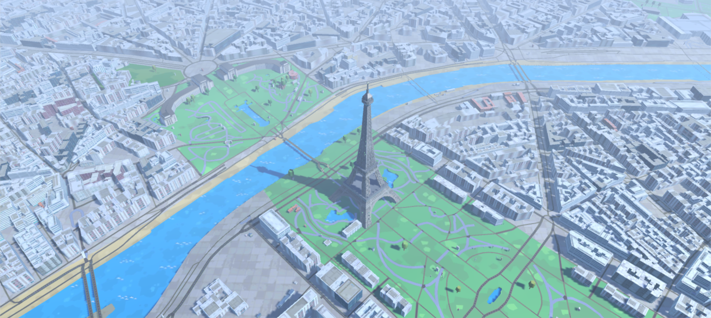
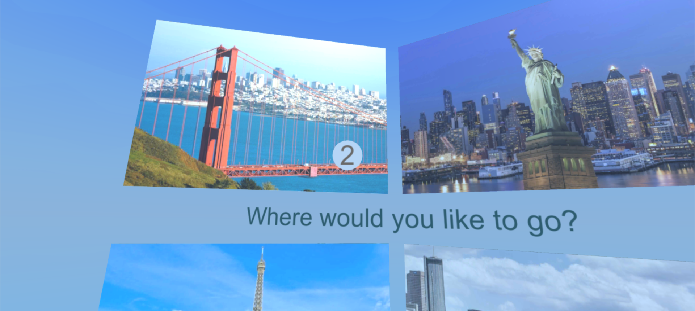
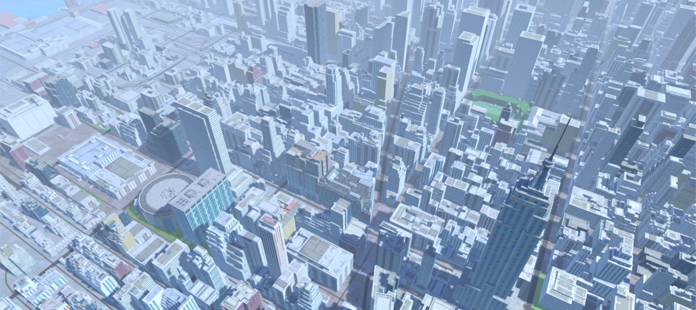
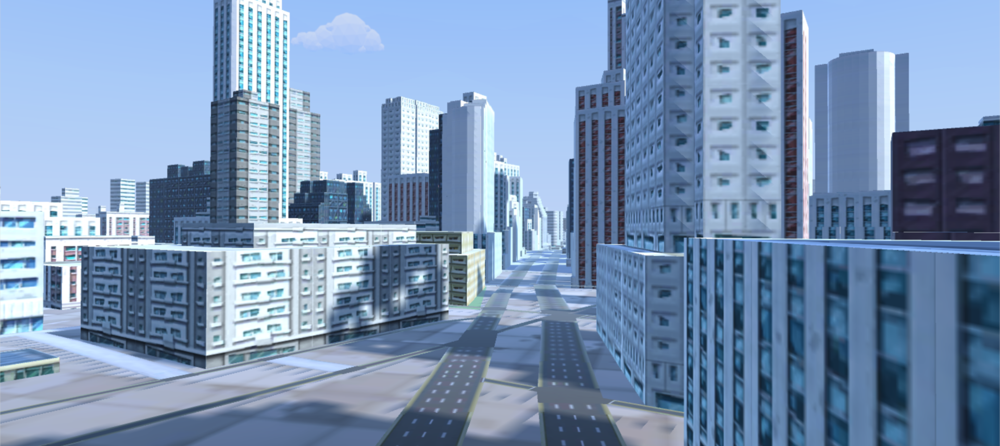
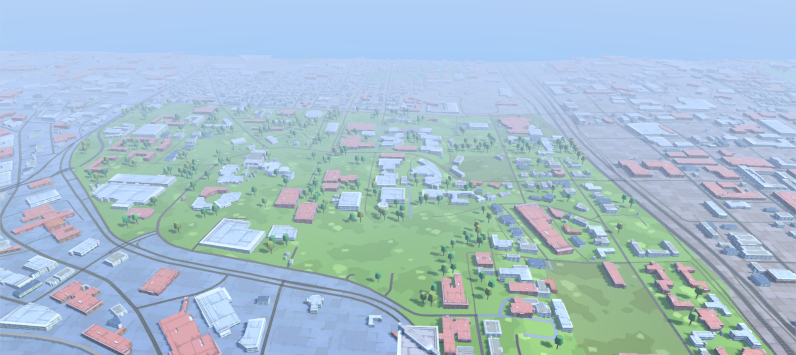
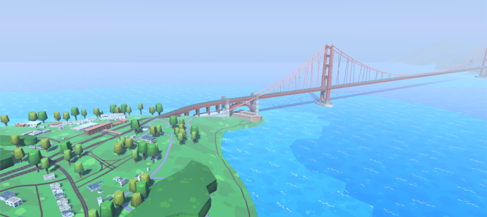

# Flight VR

This is a simple Google Cardboard VR game created with Unity. It uses Wrld3D for 3D maps of the world.

The player flies in the direction of their gaze, with a game mechanic inspired by Eagle Flight. The game restarts
upon collisions.

